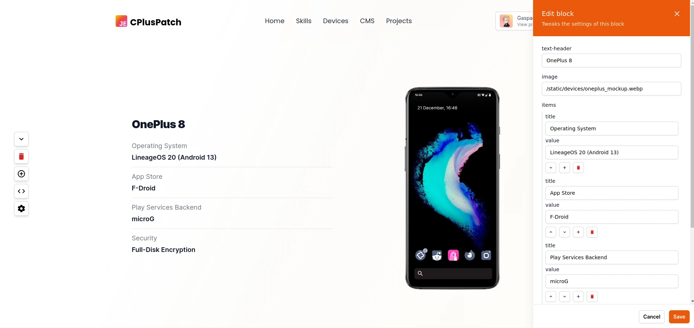
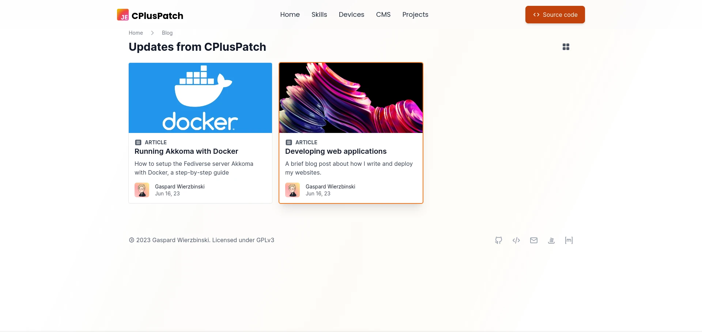
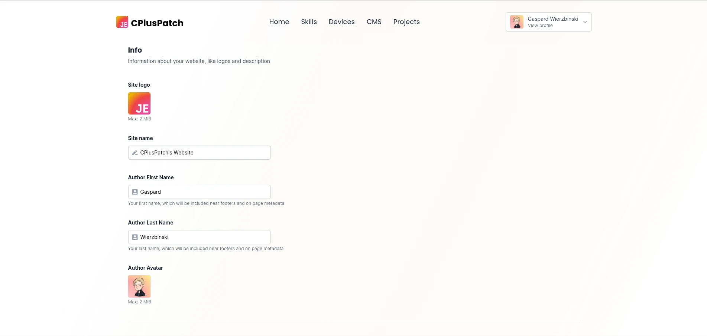
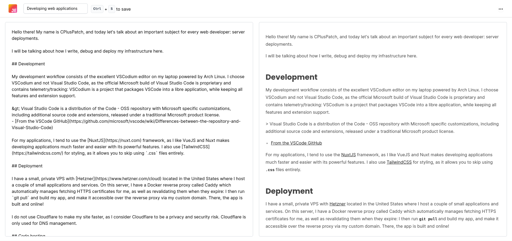
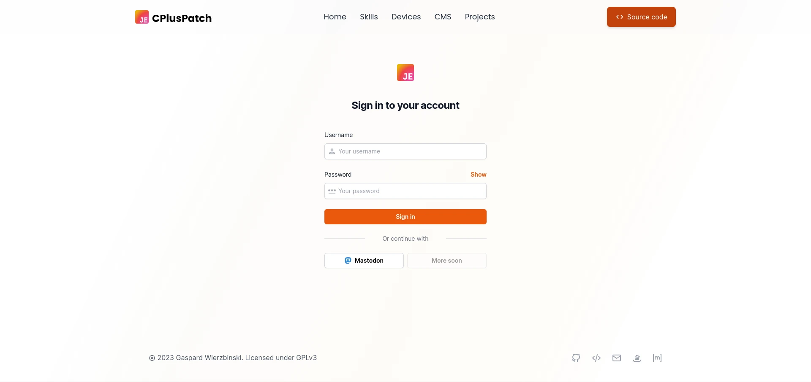

# CPlusPatch CMS

A fast, sleek and beautiful website + full content management system developed with NuxtJS.

It is designed to be minimal but efficient, secure and lightweight.

CPlusPatch CMS is a customizable system for making blogs and personal pages with a dynamic Vue-based templating engine. This is a project in **beta**, and as such should be treated as unstable.






## Requirements

- A system that can run Node.js (Linux is HEAVILY recommended), or Docker on Linux
- An S3 or S3 compatible bucket (for example, Cloudflare R2)

## Downloading and running

You may use the `docker-compose.yml` file included in this repository to bootstrap a working environment very fast.

Alternatively, download and install manually:

```bash
git clone https://codeberg.org/CPlusPatch/web-business.git
cd web-business
pnpm install
```

Then, fill out .env with credentials for the S3 or S3-compatible bucket (such as Cloudflare R2, which I am using) and for PostgreSQL.

```bash
cp .env.example .env
```

For the CDN URL, do not include a trailing slash at the end.

## Building manually

```bash
pnpm build # Bundles project into JS files

# EITHER
pnpm preview # For testing
pm2 start ecosystem.config.js # For production deployment with PM2
```

## Administration

### Adding new users (for now)

**NOTE: These instructions are temporary, an admin panel for adding users is coming soon**

You may use the following JS scripts to generate a hashed password with Node's `crypto` library:

```js
import { randomBytes, pbkdf2 } from "crypto";

export function createSalt(length = 128) {
	return randomBytes(length).toString("base64");
}

export function createPasswordHash(
	password,
	salt = "",
	iterations = 10000
) {
	return new Promise((resolve, reject) => {
		pbkdf2(password, salt, iterations, 100, "sha256", (err, derivedKey) => {
			if (err) return reject(err);
			return resolve(`${derivedKey.toString("hex")}:${salt}`);
		});
	});
}
```

To use it, run `createSalt` to generate a random salt, then run `createPasswordHash("your password here", salt)` to generate a new salted password.

Passwords are stored as `hash:salt` in the database, and `createPasswordHash` outputs this format.

To continue, you will need some kind of PostgreSQL browser and a working instance of the web app: more administration tools are coming soon.

Open to the `user` table, and insert the following row:
```
┌────────────┬───────────────────┬───────────────┬──────────────────────┐
│  username  │   display_name    │ oauthAccounts │       password       │
├────────────┼───────────────────┼───────────────┼──────────────────────┤
│ A username │ New display name  │ []            │ <password hash here> │
└────────────┴───────────────────┴───────────────┴──────────────────────┘
```

All the other fields may be left blank or will be generated automatically. If the user needs to be an admin, that is a creator of posts, insert this row instead:

```
┌────────────┬───────────────────┬───────────────┬──────────────────────┬───────┐
│  username  │   display_name    │ oauthAccounts │       password       │ role  │
├────────────┼───────────────────┼───────────────┼──────────────────────┼───────┤
│ A username │ New display name  │ []            │ <password hash here> │ admin │
└────────────┴───────────────────┴───────────────┴──────────────────────┴───────┘

```

You can save and login with your new credentials now.

## Scripts for development

### Images

Convert all JPEG images to WebP (uses ImageMagick)
```bash
magick mogrify -format webp *.jpeg
```
Convert all JPEG images to WebP (uses ImageMagick)

Resize all images to 250x250 (when adding languages to `/public/static/languages/`)
```bash
mogrify -path . -auto-orient -thumbnail 250x *.png
```

## Writing custom templates

To add custom templates to the CMS block system, open the `templates/` directory, then create two files inside a category folder: `TemplateName.vue` and `TemplateName.json`. You may also create new folders, the location doesn't matter as long as it's inside `templates/`.

Inside the `.vue` file you may write a new Vue component. You will need to add this block of code:

```vue
<script setup lang="ts">
defineProps<{
	editable: boolean;
	// You may add arbitrary props here
}>();
</script>
```
You may use TypeScript and all classes provided by [https://unocss.dev/](UnoCSS), as well as NuxtJS 3.6 utilities and any package that is included in `package.json` (such as `nuxt-img`).

Here is an example for a big hero header:

```vue
<script setup lang="ts">
defineProps<{
	imageMain?: string;
	editable: boolean;
}>();
</script>

<template>
	<!-- Main hero -->
	<div class="relative px-4 mx-auto max-w-7xl w-full sm:px-6">
		<nuxt-img
			preload
			:width="1920"
			:height="1080"
			sizes="lg:1920px md:700px sm:400px"
			class="rounded-lg aspect-video shadow-lg w-full duration-150"
			:src="
				imageMain === '' ? 'https://placehold.co/1920x1080' : imageMain
			"
			alt="VSCode screenshot" />
	</div>
</template>

```

It is recommended that you look at other files inside `templates` to get a hang of the syntax.

### Syntax for the metadata

Once your component is written, you may add your template metadata to `TemplateName.json`, like this:

```json
{
	"category": "heroes",
	"name": "BigHero",
	"displayName": "Big Banner",
	"description": "Big banner for showing off an image",
	"inputs": {
		"image-main": "string"
	},
	"defaults": {
		"image-main": ""
	}
}
```

This will allow you to auto-generate the configuration panel for your component.

The syntax for `inputs` goes as follow:

**Input types**
```json
"inputs": {
	"header-image": "image",
	"large-text": "paragraph",
	"text-input": "string",
	"invert-order": "boolean",
}
```

**Arrays**

Arrays can be declared with an array of a single object, which will be the type of all objects in the array. You can nest arrays inside arrays at will.
```json
"inputs": {
	"grid": [
		{
			"id": "string",
			"tags": [
				{
					"id": "string",
					"name": "string",
					"color": "string",
					"text-color": "string"
				}
			],
			"description": "string",
			"name": "string",
			"href": "string"
		}
	]
},
```

> **Note**: These `input` attributes will be passed to the Vue component as props, so their name will be converted to camelCase (e.g. `image-main` will be converted to `imageMain`)


## Attributions

I will add more attributions when I find the image sources (mostly logos)

Evan You, https://github.com/yyx990803, CC BY 4.0 
<https://creativecommons.org/licenses/by/4.0>, via Wikimedia Commons, for the VueJS logo

## Internals

Data is stored inside a PostgreSQL database.

When uploading images, they are converted to WebP inside the browser itself before upload.

---
Licensed under GPLv3. Made with 💕